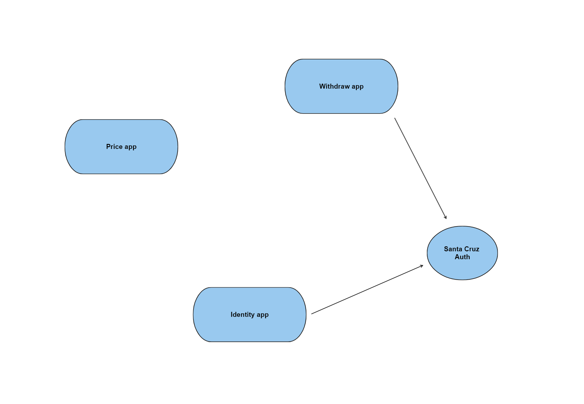

# Monorepo rails - multiapps

Funcionalidades:
- Cadastro (Identity app - Signup)
- Login (Identity app - Signin)
- Ver cadastro (Identity app - Show)
- Saque (Withdraw app - Start)
- Listar saques (Withdraw app - Index)
- Cotação (Price app - Index)

Apps:
- identity_app: app rails para cadastro, login e autenticação dos demais serviços;
- withdraw_app: app rails para saque e listagem de saques. Precisa estar autenticado para realizar saques;
- price_app: app rails para cotação. em conexão com o banco de dados. Não precisa estar autenticado para consultar a cotação;

Bibliotecas:
- santa cruz: código compartilhado entre os apps;
- santa cruz auth: autenticação compartilhada entre os apps - necessário para o identity_app e withdraw_app;

Sobre os apps:
- é um app ruby independente;
- pode ser um app rails ou não;
- tem seu próprio entrypoint - menos as libs, como santa cruz ou santa cruz auth;
- pode ter seu próprio banco de dados - price_app, por exemplo, não possui;
- tem seus próprios testes; PENDENTE
- tem suas próprias rotina de CI; PENDENTE
- tem suas próprias rotina de CD; dockerfile :)

## Configurando os apps
## multiapps
1. Rodar `docker compose up`
2. consultar o container do identity_app `docker ps | grep identity_app`
3. entrar no container `docker exec -it <container_id> bash`
4. rodar `rails db:create db:migrate`
5. consultar o container do withdraw_app `docker ps | grep withdraw_app`
3. entrar no container `docker exec -it <container_id> bash`
4. rodar `rails db:create:withdraw_app db:migrate:withdraw_app`

### price_app
Só rodar `docker compose up price_app`

### identity_app
1. Rodar `docker compose up identity_app`
2. consultar o container do identity_app `docker ps | grep identity_app`
3. entrar no container `docker exec -it <container_id> bash`
4. rodar `rails db:create db:migrate`

### withdraw_app
1. Rodar `docker compose up withdraw_app`
2. consultar o container do withdraw_app `docker ps | grep withdraw_app`
3. entrar no container `docker exec -it <container_id> bash`
4. rodar `rails db:create db:migrate`

## Rodando os testes
- TODO;

## Criando apps
### App rails ou ruby puro?
1. Para apps Rails utilizar o `rails new new_app [OPTIONS]`
   1. Se for apenas api, sem frontend utilizar `--api`
   2. se não precisar da orm (sem banco), utilizar `--skip-active-record`
2. Se não, criar uma pasta e colocar o código
3. criar new_app.gemspec
4. criar lib/new_app.rb
   1. criar, tambem, lib/new_app/engine.rb se for um app rails
5. criar dockerfile
